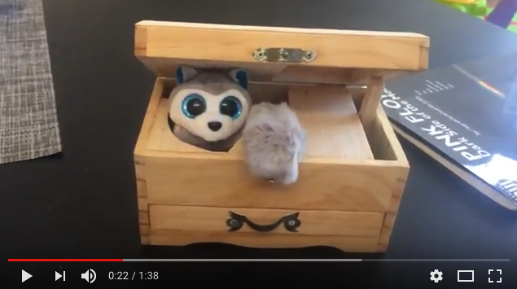
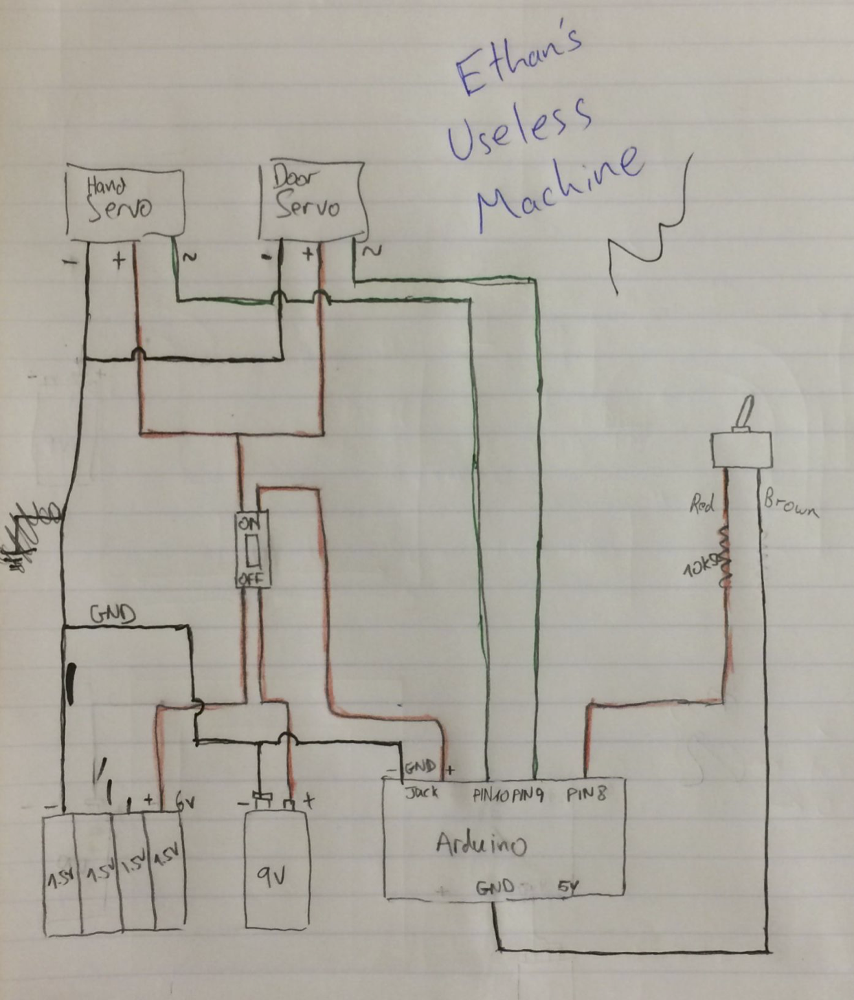

# Ethan's Useless Machine
This is a Useless Machine toy I built for my son Ethan as a present for his first birthday. It is based on some cool projects I saw on YouTube. 

I thought it would be a cool present for Ethan, as well as a fun project to build. And indeed it was.

## Overview
The machine was built in a box I bought in the flea market. After sanding it and tearing out its interiors I had enough space to fit everything in (just barely...).

Inside the box an Arduino Uno controls two servos - one for the hand and one for opening the box - based on inputs from the front switch. The system also has a switch in the back to turn it on/off.

Note that using an Arduino Uno was probably a mistake - it's quite big, and I should've used an Arduino Nano instead to save some space.

Note that two power sources are required, mainly to avoid servo humming and weird behaviors:

* A 9V battery is powering the Arduino board
* 4 regular 1.5V AA batteries are serially connected to form a 6V power source for both servos.

## Design
Here's the schematic for the electric circuit. Pardon my sketching abilities.

## Code
The code is pretty straightforward. The `setup` function only really initializes the `scenarios` table and binds the input switch. Servo binding only takes place during the first scenario to run - this is a workaround for [a bug in the servo library I was using](https://github.com/netlabtoolkit/VarSpeedServo/issues/14). Other than that bug, I was very satisfied with the [VarSpeedServo](https://github.com/netlabtoolkit/VarSpeedServo) library, and I highly recommend it. 

The basic moves are essentially helper functions that translate the specific angle values I had to use into percents. Thus, writing a value of `80` to the hand servo would mean it would be 80% out, and writing `0` would mean it would go all the way back in. This really makes the code cleaner, but note that you would have to change the "magic" numbers if you want to use this code yourself.

The rest of the code is just the various scenarios. The `runScenario` function would also print the scenario name to the serial output, so you can use that for debugging.

## Parts
I designed all parts required for the project and built them from Balsa wood. It is very easy to work with, but also fragile, so you should use some techniques to make it stronger. For example, glue together two pieces with the same shape but perpendicular fiber directions.

One can probably use a 3D printer to create the parts, but using wood was more fun for me.

# Conclusion
I had fun. The machine makes Ethan laugh, and I'm sure he will appreciate it more and more as he gets older.

I highly recommend building this project as your first Arduino project - it's quite easy, and the result is awesome.